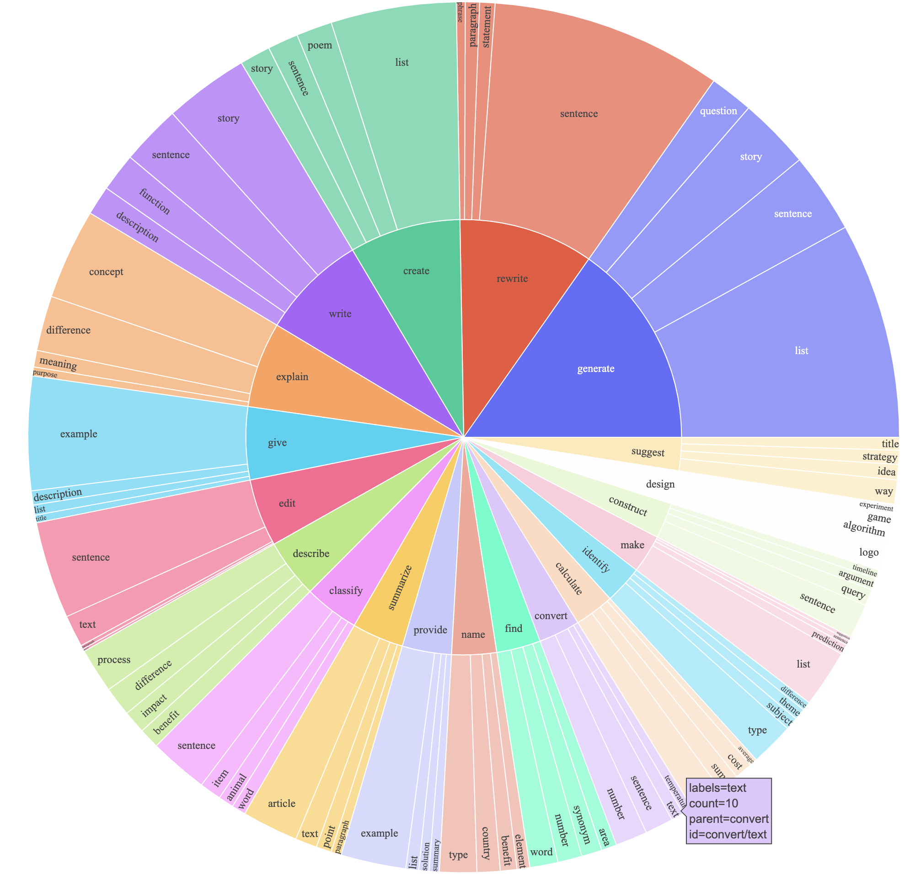

#### Self Generated instruction

Stanford alpaca instruction generation

This produced an instruction-following dataset with 52K examples. In a preliminary study, we found our 52K generated data to be much more diverse than the data released by self-instruct. We plot the below figure in the style of Figure 2 in the self-instruct paper to demonstrate the diversity of our data. The inner circle of the plot represents the root verb of the instructions, and the outer circle represents the direct objects.

